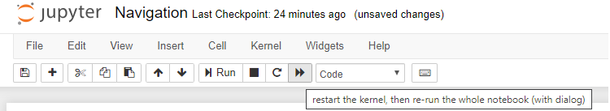

[//]: # (Image References)

[image1]: https://user-images.githubusercontent.com/10624937/42135619-d90f2f28-7d12-11e8-8823-82b970a54d7e.gif "Trained Agent"

# Project 1: Navigation

### Introduction

For this project, you will train an agent to navigate (and collect bananas!) in a large, square world.  

![Trained Agent][image1]

A reward of +1 is provided for collecting a yellow banana, and a reward of -1 is provided for collecting a blue banana.  Thus, the goal of your agent is to collect as many yellow bananas as possible while avoiding blue bananas.  

The state space has 37 dimensions and contains the agent's velocity, along with ray-based perception of objects around agent's forward direction.  Given this information, the agent has to learn how to best select actions.  Four discrete actions are available, corresponding to:
- **`0`** - move forward.
- **`1`** - move backward.
- **`2`** - turn left.
- **`3`** - turn right.

The task is episodic, and in order to solve the environment, your agent must get an average score of +13 over 100 consecutive episodes.

### Getting Started

Download the environment from one of the links below.  You need only select the environment that matches your operating system:
- Linux: [click here](https://s3-us-west-1.amazonaws.com/udacity-drlnd/P1/Banana/Banana_Linux.zip)
- Mac OSX: [click here](https://s3-us-west-1.amazonaws.com/udacity-drlnd/P1/Banana/Banana.app.zip)
- Windows (32-bit): [click here](https://s3-us-west-1.amazonaws.com/udacity-drlnd/P1/Banana/Banana_Windows_x86.zip)
- Windows (64-bit): [click here](https://s3-us-west-1.amazonaws.com/udacity-drlnd/P1/Banana/Banana_Windows_x86_64.zip)
    
(_For Windows users_) Check out [this link](https://support.microsoft.com/en-us/help/827218/how-to-determine-whether-a-computer-is-running-a-32-bit-version-or-64) if you need help with determining if your computer is running a 32-bit version or 64-bit version of the Windows operating system.

### Train Agent

Execute `Navigation.ipynb` to train your own agent! It currently support three algorithms:
- DQN ([Paper](https://storage.googleapis.com/deepmind-media/dqn/DQNNaturePaper.pdf))
- Double DQN ([Paper](https://arxiv.org/pdf/1509.06461.pdf))
- Duleing DQN ([Paper](https://arxiv.org/pdf/1511.06581.pdf))

The entire notebook can be executed by pressing play icon



The trained agents would automatically get saved in ```models/``` folder for each of the algorithms 

### Folder Structure 

- ```agents``` contains the code for all the types of agents 
- ```buffers``` contains the code for replay buffer which all the algorithms use 
- ```models``` contains the saved models generates by the code 
- ```networks``` contains the code for neural networks being used by all the algorithms 
- ```resources``` contains all the resources related with project
