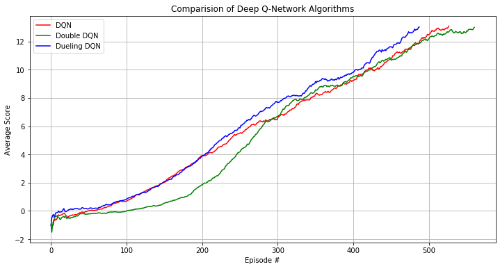

# Deep Reinforcement Learning Agent for Unity Banana App 

## Trained Agent 

Here's the gif showing the trained agent based on [DQN Algorithm](https://github.com/monusurana/reinforcement-learning-navigation/blob/master/agents/dqn_agent.py) trained on [Unity's](https://github.com/Unity-Technologies/ml-agents) Banana environment. 


## Implementation Details 

Implemented and trained three different algorithms for the same Banana environment. On an average all the three algorithms took around 500 episodes to achieve the score of 13 over 100 consecutive episodes. I implemeted these 3 algorithms:
- DQN
- Double DQN
- Dueling DQN

### DQN 

The implementation of dqn is in ```agents/dqn_agent.py``` 

### Double DQN

The implementation of double dqn is in ```agents/double_dqn_agent.py``` 

### Dueling DQN 

The implementation of dueling dqn is in ```agents/dueling_dqn_agent.py``` 

These are the common pieces for all the algorithms, primariliy inspired by the original DQN paper.

### Experience Replay 

Experience replay allows the RL agent to learn from past experience.

Each experience is stored in a replay buffer as the agent interacts with the environment. The replay buffer contains a collection of experience tuples with the state, action, reward, and next state ```(s, a, r, s')```. The agent then samples from this buffer as part of the learning step. Experiences are sampled randomly, so that the data is uncorrelated. This prevents action values from oscillating or diverging catastrophically, since a naive Q-learning algorithm could otherwise become biased by correlations between sequential experience tuples.

Also, experience replay improves learning through repetition. By doing multiple passes over the data, our agent has multiple opportunities to learn from a single experience tuple. This is particularly useful for state-action pairs that occur infrequently within the environment.

The implementation of the replay buffer can be found here in the ```buffers/ReplayBuffer.py``` file of the source code.

### Decaying Epision Greedy 

One challenge with the Q-function above is choosing which action to take while the agent is still learning the optimal policy. Should the agent choose an action based on the Q-values observed thus far? Or, should the agent try a new action in hopes of earning a higher reward? This is known as the exploration vs. exploitation dilemma.

To address this, I implemented an 𝛆-greedy algorithm. This algorithm allows the agent to systematically manage the exploration vs. exploitation trade-off. The agent "explores" by picking a random action with some probability epsilon 𝛜. However, the agent continues to "exploit" its knowledge of the environment by choosing actions based on the policy with probability (1-𝛜).

Furthermore, the value of epsilon is purposely decayed over time, so that the agent favors exploration during its initial interactions with the environment, but increasingly favors exploitation as it gains more experience. The starting and ending values for epsilon, and the rate at which it decays are three hyperparameters that are later tuned during experimentation.

You can find the 𝛆-greedy logic implemented as part of the ```act()``` method in ```dqn_agent.py``` of the source code.

### Target Network 

Iterative update that adjusts the action-values towards target values that are only periodically updated, thereby reducing correlations with the target.

The target values are updated based on this equation. 
```
 θ_target = τ*θ_local + (1 - τ)*θ_target
```

You can find logic implemented in ```soft_update()``` method in ```dqn_agent.py``` of the source code. 

## Results

### Comparison of different Deep Q-Network Algorithms



## Ideas for future work 
- Tuning of hyperparameters for the network 
- Use Prioritized Experience Replay 
- Implement Rainbow Paper
