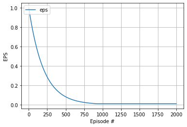
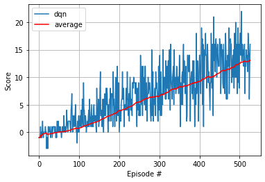
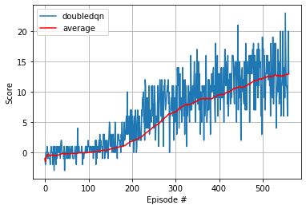
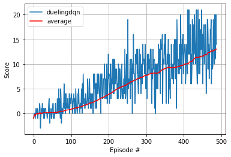

# Deep Reinforcement Learning Agent for Unity Banana App 

## Trained Agent 

Here's the gif showing the trained agent based on [DQN Algorithm](https://github.com/monusurana/reinforcement-learning-navigation/blob/master/agents/dqn_agent.py) trained on [Unity's](https://github.com/Unity-Technologies/ml-agents) Banana environment. 


## Implementation Details 

Implemented and trained three different algorithms for the same Banana environment. On an average all the three algorithms took around 500 episodes to achieve the score of 13 over 100 consecutive episodes. I implemeted these 3 algorithms:
- DQN
- Double DQN
- Dueling DQN

### DQN 

The implementation of dqn is in ```agents/dqn_agent.py``` and the trained model can be found at ```models/checkpoint_dqn.pth```

#### Network Architecture
```
QNetwork(
  (fc1): Linear(in_features=37, out_features=64, bias=True)
  (bn1): BatchNorm1d(64, eps=1e-05, momentum=0.1, affine=True, track_running_stats=True)
  (fc2): Linear(in_features=64, out_features=64, bias=True)
  (bn2): BatchNorm1d(64, eps=1e-05, momentum=0.1, affine=True, track_running_stats=True)
  (fc3): Linear(in_features=64, out_features=4, bias=True)
)
```

### Double DQN

This is an enhancement on top of DQN, primarily focused on how the target network in updated. 

The implementation of double dqn is in ```agents/double_dqn_agent.py``` and the trained model can be found at ```models/checkpoint_doubledqn.pth```

#### Network Architecture
```
QNetwork(
  (fc1): Linear(in_features=37, out_features=64, bias=True)
  (bn1): BatchNorm1d(64, eps=1e-05, momentum=0.1, affine=True, track_running_stats=True)
  (fc2): Linear(in_features=64, out_features=64, bias=True)
  (bn2): BatchNorm1d(64, eps=1e-05, momentum=0.1, affine=True, track_running_stats=True)
  (fc3): Linear(in_features=64, out_features=4, bias=True)
)
```

### Dueling DQN 

The implementation of dueling dqn is in ```agents/dueling_dqn_agent.py``` and the trained model can be found at ```models/checkpoint_duelingdqn.pth```

#### Network Architecture
```
DuelingQNetwork(
  (feature): Sequential(
    (0): Linear(in_features=37, out_features=64, bias=True)
    (1): BatchNorm1d(64, eps=1e-05, momentum=0.1, affine=True, track_running_stats=True)
    (2): ReLU()
  )
  (advantage): Sequential(
    (0): Linear(in_features=64, out_features=64, bias=True)
    (1): BatchNorm1d(64, eps=1e-05, momentum=0.1, affine=True, track_running_stats=True)
    (2): ReLU()
    (3): Linear(in_features=64, out_features=4, bias=True)
  )
  (value): Sequential(
    (0): Linear(in_features=64, out_features=64, bias=True)
    (1): BatchNorm1d(64, eps=1e-05, momentum=0.1, affine=True, track_running_stats=True)
    (2): ReLU()
    (3): Linear(in_features=64, out_features=1, bias=True)
  )
)
```

These are the common pieces for all the algorithms, primariliy inspired by the original DQN paper.

### Experience Replay 

Experience replay allows the RL agent to learn from past experiences. Each experience is stored in a replay buffer as the agent interacts with the environment. The replay buffer contains experience tuples with the state, action, reward, and next state ```(s, a, r, s')```. The agent randomly samples from this buffer as part of the training. Random samplaing helps with the problem of correlated data. This prevents action values from oscillating, since a naive Q-learning algorithm could otherwise become biased by correlations between sequential experience tuples.

Also, experience replay improves learning through repetition. By doing multiple passes over the data, our agent has multiple opportunities to learn from a single experience tuple. This is particularly useful for state-action pairs that occur infrequently within the environment.

The implementation of the replay buffer can be found here in the ```buffers/ReplayBuffer.py``` file of the source code.

### Decaying Epsilon Greedy 

𝛆-greedy algorithm helps with the exploration vs. exploitation trade-off. The agent "explores" by picking a random action with some probability epsilon 𝛜. However, the agent continues to "exploit" its knowledge of the environment by choosing actions based on the policy with probability (1-𝛜).

The value of epsilon is decayed over time, so that the agent favors exploration during its initial interactions with the environment, but increasingly favors exploitation as it gains more experience.

This is how the decaying 𝛆 looks like (it decays from 1.0 to 0.01 and then stays there):



You can find the 𝛆-greedy logic implemented as part of the ```act()``` method in ```dqn_agent.py``` of the source code.

#### Code snippet 
```
# Epsilon-greedy action selection
if random.random() > eps:
    return np.argmax(action_values.cpu().data.numpy())
else:
    return random.choice(np.arange(self.action_size))
```

### Target Network 

Iterative update that adjusts the action-values towards target values that are only periodically updated, thereby reducing correlations with the target.

The target values are updated based on this equation. 
```
 θ_target = τ*θ_local + (1 - τ)*θ_target
```

You can find logic implemented in ```soft_update()``` method in ```dqn_agent.py``` of the source code. 

## Hyperparameters 

The agent uses these parameters
```
BUFFER_SIZE = int(1e5)  # replay buffer size
BATCH_SIZE = 64         # minibatch size
GAMMA = 0.99            # discount factor
TAU = 1e-3              # for soft update of target parameters
LR = 5e-4               # learning rate 
UPDATE_EVERY = 4        # how often to update the network
```

The training part uses these paramters
```
Number of training episodes = 2000
Max number of steps in an episode = 1000
Epsilon start vale = 1.0
Epsilon end value = 0.01
Epsilon decay rate = 0.995
```

## Results

### Results for all the algorithms


### Comparison of average score for different Deep Q-Network Algorithms


## Ideas for future work 
- Tuning of hyperparameters for the network 
- Use Prioritized Experience Replay ([Link](https://arxiv.org/pdf/1511.05952.pdf))
- Implement Rainbow Paper ([Link](https://arxiv.org/pdf/1710.02298.pdf))
